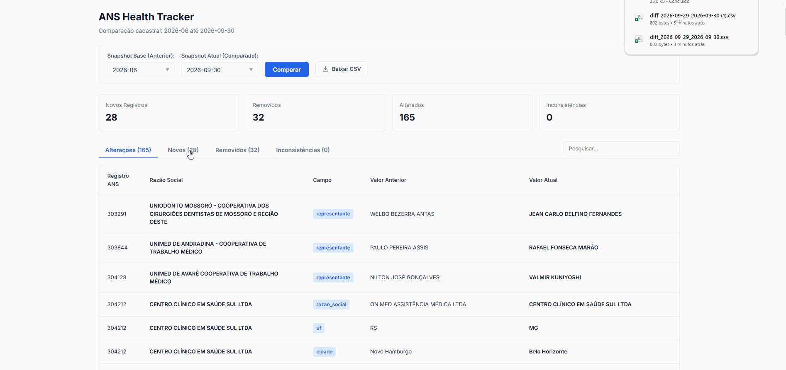

# ANS Health Tracker - Monitoramento e Análise Cadastral de Operadoras ANS

> **Demo online:** [web-production-a3f77.up.railway.app](https://web-production-a3f77.up.railway.app/)

<p align="center">
  
</p>

Aplicação desenvolvida em Python para monitorar, comparar e analisar snapshots periódicos do cadastro de operadoras de planos de saúde da ANS (Agência Nacional de Saúde Suplementar - CADOP).

Conta com interface CLI, API REST com FastAPI, painel web com Vue.js e pipeline automatizado com GitHub Actions.

---

## Recursos e Funcionalidades

* **Automação Diária (GitHub Actions):** Pipeline agendado que consulta e sincroniza novos snapshots da ANS diariamente.
* **Sincronização em Nuvem (GitHub API):** Persistência e recuperação automática de dados para ambientes em nuvem (Railway, Render, Docker).
* **Rastreamento e Comparação Histórica:** Comparação entre quaisquer períodos cadastrados, identificando operadoras adicionadas, canceladas e alterações de dados cadastrais.
* **Mudanças Críticas e Inconsistências:** Alertas para alterações em modalidade/situação e validação de integridade (CNPJ, duplicidades, campos vazios).
* **Relatórios e Exportação:** Visualização no painel web, no terminal (CLI) e download em CSV padronizado.

---

## Estrutura do projeto

```text
.
├── .github/
│   └── workflows/
│       └── daily_sync.yml    # Automação diária via GitHub Actions
├── data/
│   └── snapshots/            # Snapshots históricos em CSV
├── static/
│   └── index.html            # Interface web com Vue.js
├── analyzer.py               # Motor de análise e validação de inconsistências
├── api.py                    # Servidor FastAPI e rotas web
├── comparator.py             # Comparador diferencial entre períodos
├── config.py                 # Configurações globais
├── fetcher.py                # Download e detecção de versão da ANS
├── github_sync.py            # Sincronização de dados via GitHub API
├── loader.py                 # Carregamento e sanitização com pandas
├── main.py                   # Interface CLI de terminal
├── models.py                 # Dataclasses de domínio
├── reporter.py               # Relatórios no terminal e CSV
├── requirements.txt          # Dependências do projeto
├── .env.example              # Exemplo de variáveis de ambiente
├── .gitignore
└── README.md
```

---

## Como executar

### 1. Instalação de Dependências

```bash
pip install -r requirements.txt
```

### 2. Variáveis de Ambiente (Opcional)

Para sincronização remota via GitHub API, crie o `.env`:

```env
GITHUB_TOKEN=seu_token_pessoal_aqui
GITHUB_REPO=ronaldodfilho/ANS-TRACKER-PY
```

### 3. Execução pelo Terminal (CLI)

Comparar com a versão mais recente da ANS:

```bash
python main.py 2026-06 --exportar
```

Comparar entre dois períodos específicos:

```bash
python main.py 2026-06 2026-09-30 --exportar
```

### 4. Execução da Interface Web (FastAPI + Vue.js)

```bash
python api.py
```

Acesse no navegador: `http://localhost:8000`

---

## Automação com GitHub Actions

O workflow `.github/workflows/daily_sync.yml` executa diariamente às **08:00 BRT** (11:00 UTC) e salva novos snapshots em `data/snapshots/` apenas quando houver atualizações na base oficial.

---

## Autor

Ronaldo Dutra Filho
